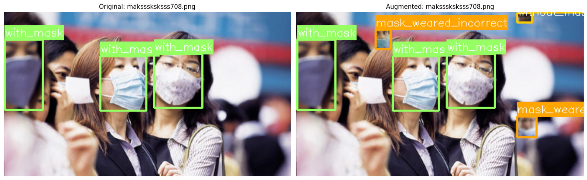
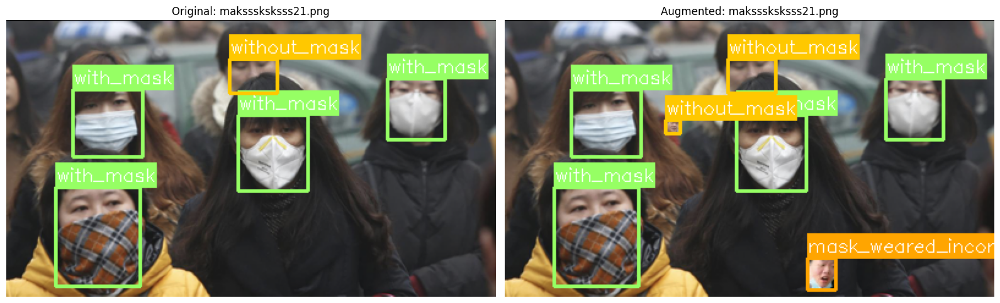
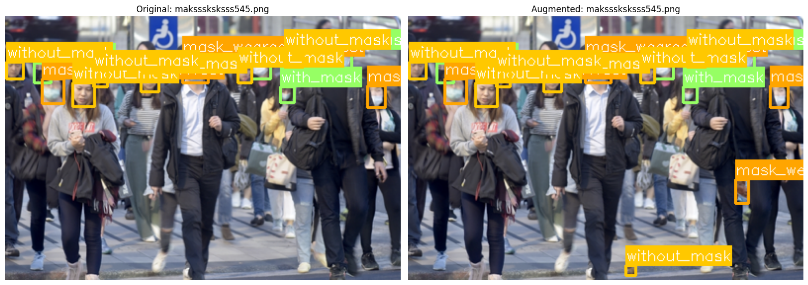
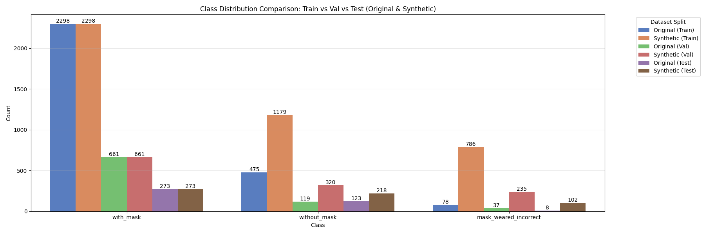
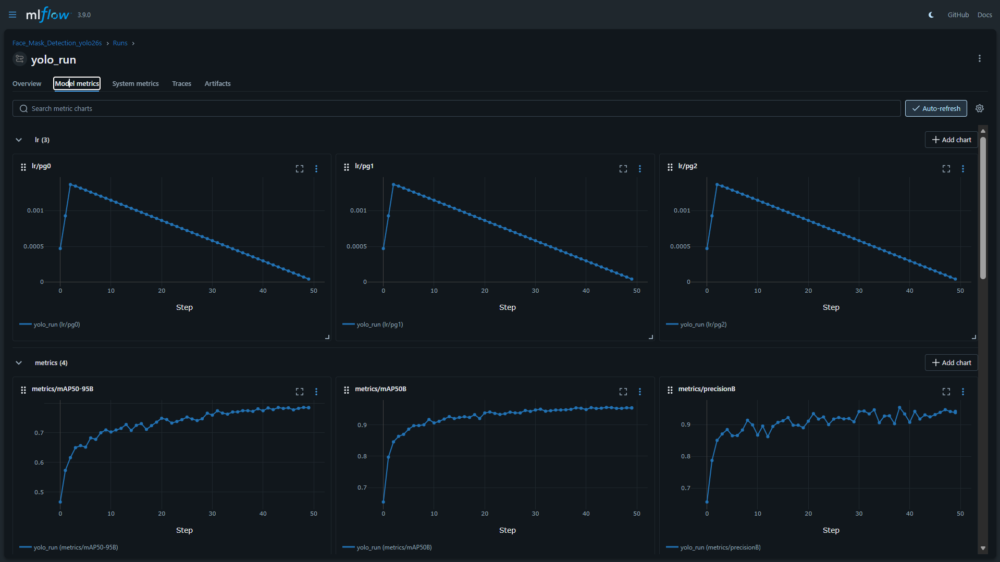
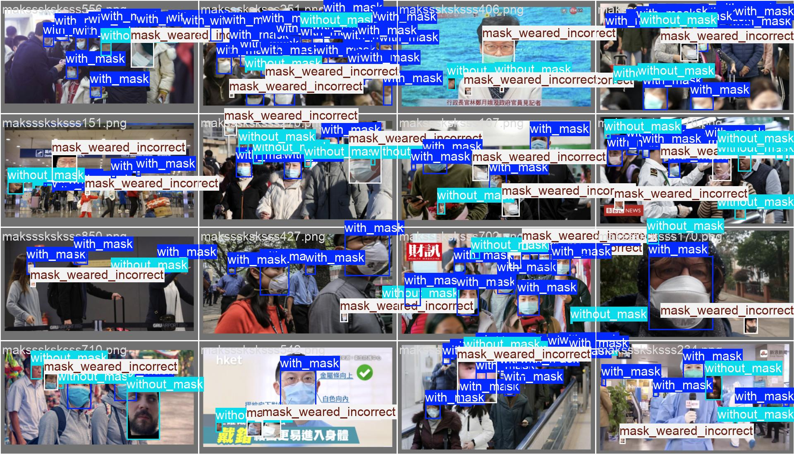
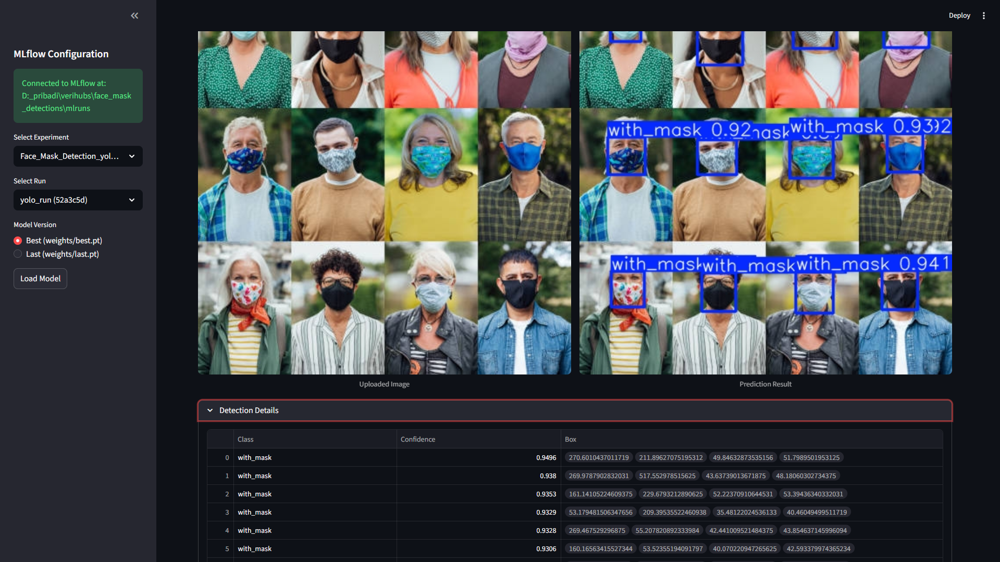

# Face Mask Detection Project

This project implements a complete MLOps pipeline for Face Mask Detection, demonstrating data ingestion, synthetic data generation, model training with experiment tracking, and deployment via a Streamlit inference application.

## 📌 Project Overview

The goal is to detect whether a person is wearing a mask, not wearing one, or wearing it incorrectly. The solution leverages:

- **Object Detection Models**: YOLO26s.
- **MLOps**: **MLflow** for experiment tracking, model versioning, and artifact management.
- **Data Engineering**: Synthetic data augmentation to balance classes and increase dataset diversity.
- **Deployment**: An interactive **Streamlit** application for real-time inference using tracked models.

## 📂 Project Structure

```text
├── data/                   # Dataset directory
│   ├── images/             # Original images
│   ├── annotations/        # Pascal VOC XML annotations
│   ├── yolo_dataset/       # Generated YOLO format (train/val/test splits)
│   └── synthetic_augmented/# Synthetically generated data
├── mlruns/                 # MLflow local tracking store
│   └── 837942597571710281/ # Experiment ID for Face Mask Detection
├── notebooks/              # Jupyter Notebooks
│   └── Face_Mask_Detection.ipynb  # Main training pipeline
├── src/                    # Source code modules
│   ├── dataset.py          # PyTorch Dataset class (FaceMaskDataset)
│   ├── utils.py            # Utilities for YOLO conversion & stratified splitting
│   └── mlflow_utils.py     # Custom MLflow integration helpers
├── models/                 # Local model storage (optional)
├── inference.py            # Streamlit Inference Application
├── requirements.txt        # Project dependencies
└── README.md               # Project documentation
```

## 🚀 Setup & Installation

1. **Clone the repository:**

   ```
   git clone https://github.com/arifsoul/face_mask_detections.git
   ```

2. **Create a Virtual Environment** (recommended):

   ```bash
   python -m venv .venv
   # Windows
   .venv\Scripts\activate
   # Linux/Mac
   source .venv/bin/activate
   ```

3. **Install Dependencies**:

   ```bash
   pip install -r requirements.txt
   ```

## 📊 Dataset Preparation & Training

The training process is encapsulated in `notebooks/Face_Mask_Detection.ipynb`.

### Key Steps in the Notebook

1. **Data Loading**: Uses `src/dataset.py` to parse the Kaggle Face Mask Dataset.
2. **Synthetic Augmentation**: Generates synthetic samples by cropping objects (masks/faces) and pasting them onto existing images to balance the dataset.

   To ensure robustness and realism, the following augmentations are applied to the pasted objects:

   - **`RandomRotation(degrees=15)`**: Simulates natural head tilts (up to ±15 degrees).
   - **`RandomHorizontalFlip(p=0.5)`**: Ensures the model is invariant to face orientation (left/right).
   - **`ColorJitter(brightness=0.2, contrast=0.2, saturation=0.2, hue=0.05)`**: Simulates different lighting conditions and camera sensors.
   - **`RandomAffine(translate=(0.1, 0.1), scale=(0.8, 1.2), shear=10)`**: Adds variety in object scale (0.8x to 1.2x) and perspective (shear), mimicking varying distances and angles.

   **Examples of Synthetic Data:**

   | Sample 1 | Sample 2 | Sample 3 |
   | :---: | :---: | :---: |
   |  |  |  |

   
3. **YOLO Conversion**: Uses `src.utils.stratified_yolo_split` to:

   - Perform a stratified split (Train 70% / Val 20% / Test 10%).
   - Convert Pascal VOC XMLs to YOLO TXT format.
   - Generate `data.yaml`.
4. **Training with MLflow**:

   - Initializes a **YOLO26s** model (e.g., `yolo26s`).
   - Logs system metrics, parameters, and training artifacts to **MLflow**.
   - Experiment Name: `Face_Mask_Detection_yolo26s`.
   - Tracking URI: Local `mlruns` directory.

### To Run Training

Open and execute the notebook:

```bash
jupyter notebook notebooks/Face_Mask_Detection.ipynb
```

## 🧪 Experiments & Results

All training runs are tracked in the local `mlruns` directory.

- **Experiment ID**: `837942597571710281`
- **Artifacts**: Weights (`best.pt`, `last.pt`), confusion matrices, PR curves, and training logs are stored here.
- **Viewing Results**:

  ```bash
  mlflow ui --backend-store-uri mlruns
  ```

  

## 📈 Reference Run Analysis

The repository includes a complete training run stored in `mlruns/837942597571710281/52a3c5d3b4fb488399a31b396336cb1e`. This serves as a baseline for performance.

### **Hyperparameters**

| Parameter            | Value                         |
| :------------------- | :---------------------------- |
| **Model**      | `yolo26s.pt` (YOLO26 small) |
| **Epochs**     | 50                            |
| **Batch Size** | 8                             |
| **Image Size** | 640                           |
| **Device**     | GPU (if available) / CPU      |

### **Performance Metrics (Final Epoch)**

| Metric              | Value           | Description                                         |
| :------------------ | :-------------- | :-------------------------------------------------- |
| **mAP50-95**  | **0.785** | Mean Average Precision at IoU 0.50:0.95             |
| **mAP50**     | **0.954** | Mean Average Precision at IoU 0.50                  |
| **Precision** | **0.942** | True Positives / (True Positives + False Positives) |
| **Recall**    | **0.903** | True Positives / (True Positives + False Negatives) |

### **Artifacts & Visual Analysis**

#### **1. Training Performance**

The training process over 50 epochs shows a steady decrease in loss and improvement in precision/recall metrics.


#### **2. Confusion Matrix**

The model demonstrates high accuracy across all three classes, with minimal confusion between "with_mask" and "without_mask".


#### **3. Precision-Recall Curve**

The Precision-Recall curve illustrates the trade-off between precision and recall for different thresholds. The high area under the curve (0.785 for mAP50-95) indicates a robust model.


#### **4. F1-Score Curve**

The F1-Score curve helps in identifying the optimal confidence threshold for balancing precision and recall.


#### **5. Model Predictions (Validation Batch)**

A sample batch from the validation set showing ground truth labels vs. model predictions.

|                   Ground Truth                   |               Model Predictions               |
| :----------------------------------------------: | :-------------------------------------------: |
|  |  |

---

## 🕵️ Inference Application

A Streamlit-based UI is provided in `inference.py` to test trained models. It connects directly to the local MLflow registry to fetch the best model from a selected run.

### Features

- **MLflow Integration**: Browse active experiments and runs directly from the sidebar.
- **Model Loading**: Automatically downloads the `best.pt` artifact from the selected MLflow run.
- **Interactive Inference**: Upload an image, adjust confidence thresholds, and view detection results with bounding boxes and class labels.

### Usage

Run the Streamlit app:

```bash
streamlit run inference.py
```

1. **Select Experiment**: Choose `Face_Mask_Detection_...` from the sidebar.
2. **Select Run**: Pick a training run (sorted by time).
3. **Load Model**: Click "Load Model" to fetch weights.
4. **Upload Image**: Upload a test image (.jpg, .png) to see detections.



## ⚠️ Limitations

- **Synthetic Data Quality**: The current synthetic data generation uses simple object overlay. This limits the realism of the generated images compared to techniques like Poisson blending or GAN-based generation.
- **Class Imbalance Handling**: While synthetic data addresses imbalance, the diversity of the synthetic samples is constrained by the number of unique "mask" and "face" crops available in the original dataset.
- **Model Size**: The `yolo26s` (Small) model balances speed and accuracy but may struggle with very small or highly occluded faces compared to larger YOLO variants (Medium/Large).

## 🔮 Future Work

- **Advanced Data Augmentation**: Implement **Mosaic** and **MixUp** augmentations during training (natively supported by YOLO) to improve robustness.
- **Hyperparameter Optimization**: Integrate **Ray Tune** or **Optuna** with MLflow to automatically find the best learning rate, weight decay, and other hyperparameters.
- **Edge Deployment**: Export the trained model to **ONNX** or **TensorRT** format for optimized inference on edge devices (e.g., Raspberry Pi, Jetson Nano).
- **Video Inference**: Extend the Streamlit app to support real-time video stream inference from a webcam.

**Author**: Ahmad Arif Sultoni
